# Web Application Security Assessment Lab


---

## Overview

In this project, I performed a security assessment against a deliberately vulnerable e-commerce web application designed to simulate common web security weaknesses.

The objective was to identify, analyse, and validate vulnerabilities affecting authentication, access control, input validation, session management, and database security. Throughout the assessment, I investigated several attack vectors commonly found in real-world applications, including SQL Injection, Cross-Site Scripting (XSS), Broken Access Control, and Business Logic vulnerabilities.

This project provided practical experience in web application security testing while reinforcing secure development principles and OWASP Top 10 concepts.

---

## Security Context

Web applications are among the most frequently targeted attack surfaces. Vulnerabilities such as SQL Injection, Cross-Site Scripting (XSS), Broken Access Control, and insecure business logic can lead to unauthorised access, data exposure, and application compromise.

This assessment demonstrates how common security weaknesses can be identified and highlights the importance of secure coding practices, input validation, and proper access control mechanisms.

---

## Skills & Technologies

- Web Application Security Testing
- SQL Injection Analysis
- Cross-Site Scripting (XSS)
- Access Control Testing
- Session Management Analysis
- Business Logic Testing
- Burp Suite
- Browser Developer Tools
- HTTP Request Analysis
- OWASP Top 10 Methodology

---

## Tools Used

-  Burp Suite (Web Application Interception & Testing)
-  Kali Linux (Penetration Testing Environment)
-  Mozilla Firefox (Browser Testing & Dev Tools)
- Browser Developer Tools (Inspection & Debugging)
- HTTP Request Analysis (Proxy Interception)

---

## Assessment Scope

The security assessment focused on:

- User Authentication
- Administrative Functionality
- Search Features
- User Registration
- Session Management
- Shopping Basket Logic
- Password Management
- Advanced Search Functionality
- Database Security

---

## Scoreboard / Challenge Overview

The application includes a built-in scoreboard that tracks all available security challenges within the system. Each challenge represents a different vulnerability class commonly found in real-world web applications.

The scoreboard acts as a central reference point for tracking progress throughout the assessment. As each vulnerability is successfully identified and exploited, the corresponding challenge is marked as completed.

📌 Full Challenge Scoreboard

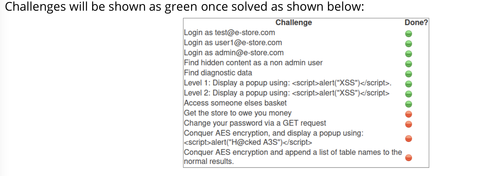

---

## Challenge Breakdown

The following vulnerabilities were assessed within the application:

- SQL Injection (Authentication Bypass)
- Hidden Administrative Page Discovery
- Reflected Cross-Site Scripting (XSS)
- Stored Cross-Site Scripting (XSS)
- Broken Access Control (IDOR)
- Business Logic Manipulation
- Password Change Request Manipulation
- Client-Side Validation Bypass
- Advanced SQL Injection (Database Enumeration)

📌 Application Overview

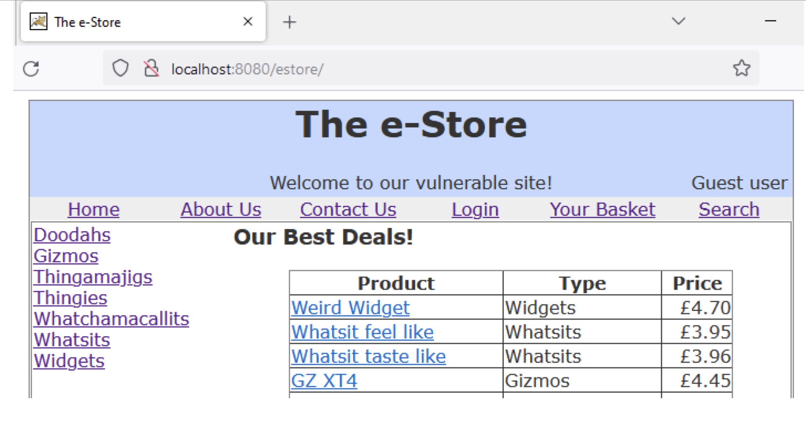

---

## Challenge 1 – Authentication Bypass (SQL Injection)

Testing revealed that user input was not properly sanitised before being incorporated into backend database queries. This allowed authentication controls to be bypassed and resulted in unauthorised access to the application.

### Impact

- Authentication bypass
- Unauthorised account access
- Exposure of protected functionality

📌 Screenshot

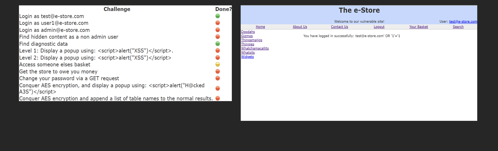

---

## Challenge 4 – Hidden Administrative Functionality

Source code inspection revealed references to administrative functionality that was hidden from normal navigation. Further testing showed that the page could be accessed directly through URL manipulation without authentication.

### Impact

- Unauthorised administrative access
- Information disclosure
- Increased attack surface

📌 Screenshot

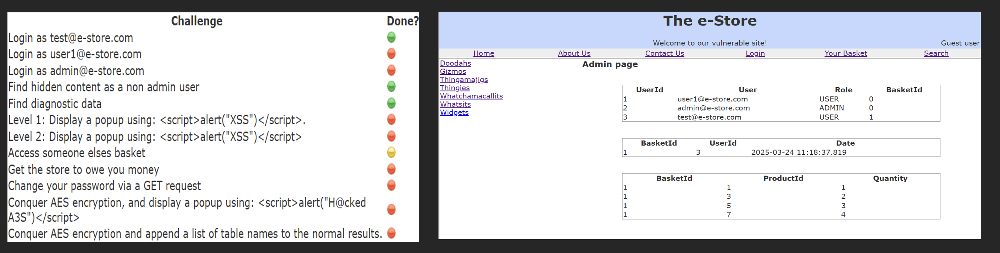

---

## Challenge 6 – Reflected Cross-Site Scripting (XSS)

The search functionality was vulnerable to reflected XSS because user input was returned directly to the browser without proper output encoding.

### Impact

- Client-side code execution
- Session theft risk
- User impersonation attacks

📌 Screenshot

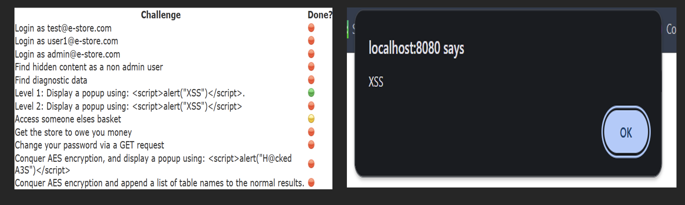

---

## Challenge 7 – Stored Cross-Site Scripting (XSS)

Malicious input submitted during registration was stored by the application and executed when rendered to users, resulting in a stored XSS vulnerability.

### Impact

- Persistent script execution
- Session compromise
- User-targeted attacks

📌 Screenshot

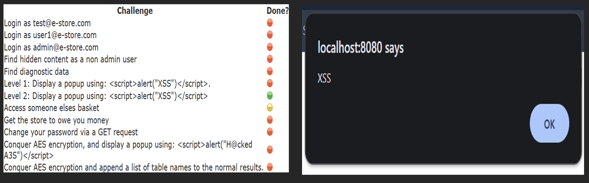

---

## Challenge 8 – Broken Access Control (IDOR)

Weak access control mechanisms allowed unauthorised access to another user's shopping basket.

### Impact

- Unauthorised data access
- Privacy violations
- Broken access controls

📌 Screenshot

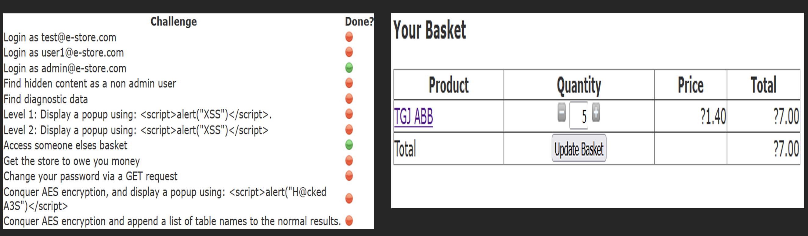

---

## Challenge 9 – Business Logic Vulnerability

The application accepted manipulated quantity values without proper validation, resulting in incorrect calculations and abnormal transaction outcomes.

### Impact

- Financial manipulation
- Data integrity issues
- Abuse of business processes

📌 Screenshot

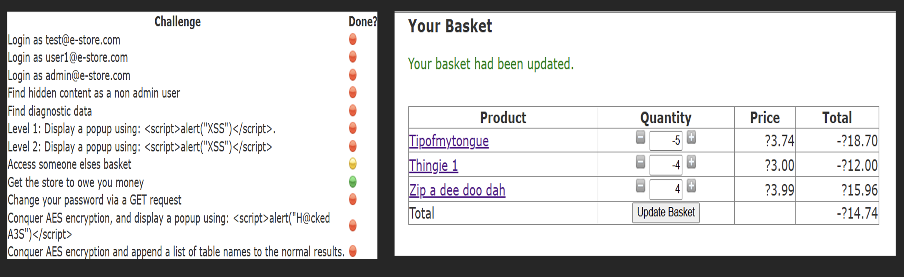

---

## Challenge 10 – Password Management Weakness

Password change requests could be manipulated and processed without sufficient validation controls.

### Impact

- Unauthorised password modification
- Account compromise risk
- Weak request validation

📌 Screenshot

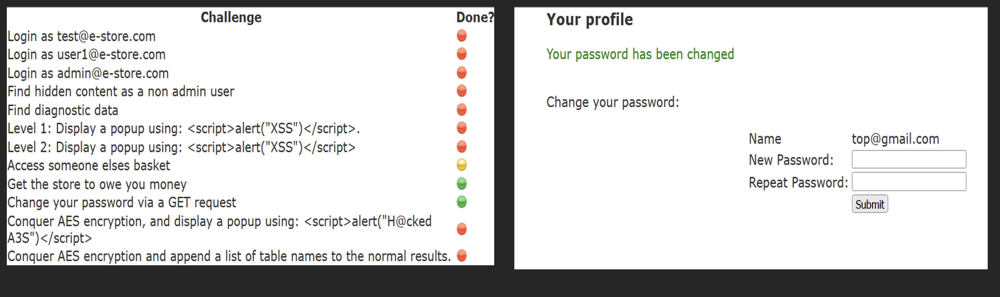

---

## Challenge 11 – Client-Side Validation Bypass

Client-side protections were bypassed, allowing malicious input to reach the application.

### Impact

- Input validation bypass
- Client-side code execution
- Increased attack surface

📌 Screenshot

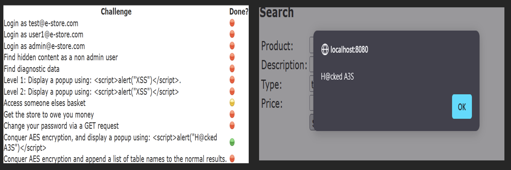

---

## Challenge 12 – Advanced SQL Injection Assessment

Further testing demonstrated that backend database queries remained vulnerable to SQL injection, allowing disclosure of database metadata and schema information.

### Impact

- Database information disclosure
- Schema enumeration
- Potential for further compromise

📌 Screenshot

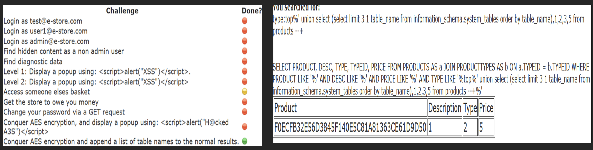

---

## Key Findings

- SQL Injection
- Reflected XSS
- Stored XSS
- Broken Access Control
- Session Management Weaknesses
- Business Logic Vulnerabilities
- Client-Side Validation Bypass
- Information Disclosure

---

## Conclusion

This project provided hands-on experience identifying and analysing common web application vulnerabilities within a controlled environment. It strengthened my understanding of authentication security, access control, database security, session management, and secure development practices while providing practical exposure to common attack techniques and OWASP Top 10 risks.

---

## Folder Structure

```bash
images/
├── application-overview.png
├── challenge-1.png
├── challenge-4.png
├── challenge-6.png
├── challenge-7.png
├── challenge-8.png
├── challenge-9.png
├── challenge-10.png
├── challenge-11.png
└── challenge-12.png

README.md
```
